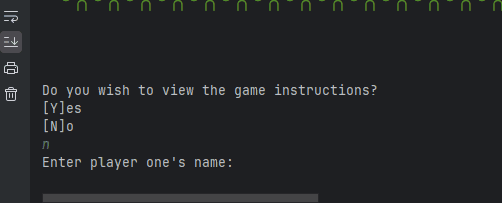
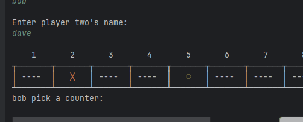
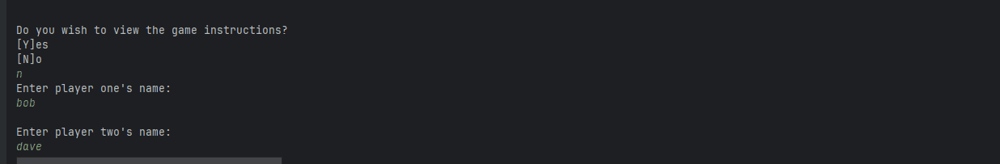
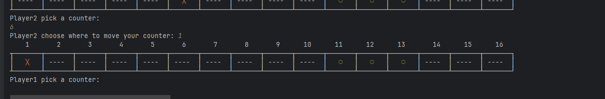
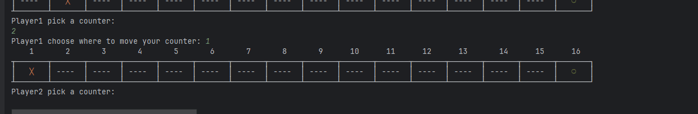
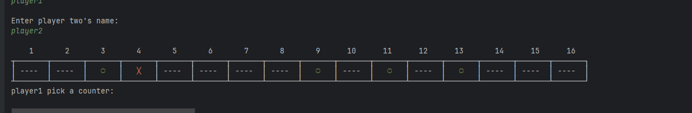

# Results of Testing

The test results show the actual outcome of the testing, following the [Test Plan](test-plan.md)

---

## Input Name - Invalid / Valid
Test to prove that invalid names will be rejected
### Test Data To Use
I will try adding no name into both of the player name functions to prove that it will not accept them.
### Test Results

---

## Counter Skipping - Invalid
Test to determine that counters cannot skip over each other
### Test Data To Use
I will try to skip a counter over another one to prove that it will not skip.
### Test Results

---

## Board Setup - Gameplay
Test to determine that counters will set up automatically without any errors
### Test Data To Use
I will set up the board 3 times and make sure there are no errors.
### Test Results

---

## Player 1 win - Gameplay
Test to determine that the player1 win code works.
### Test Data To Use
I will trigger the player 1 win line.
### Test Results

---

## Player 2 win - Gameplay
Test to determine that the player2 win code works.
### Test Data To Use
I will trigger the player 2 win line.
### Test Results

---

## Error Checking
Test to determine that multiple  error checking works
### Test Data To Use
I will trigger the can not move left error message, the out of bounds message, and choose empty square error message.
### Test Results

---
